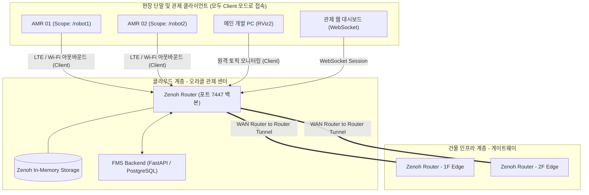
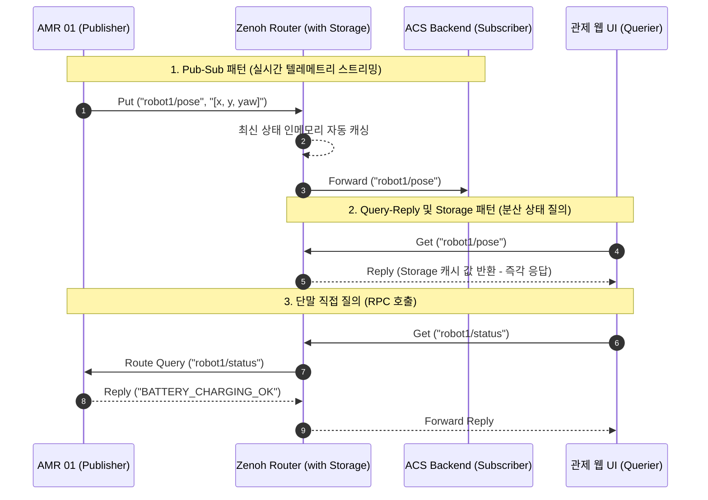
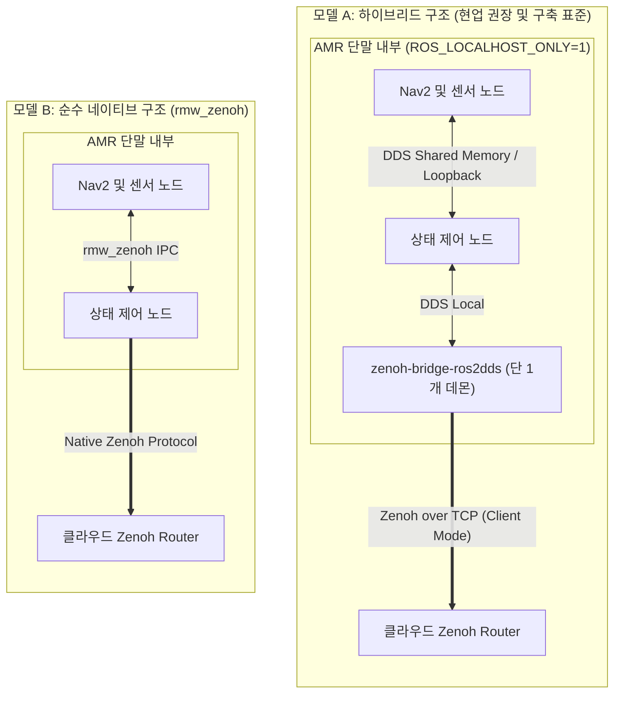
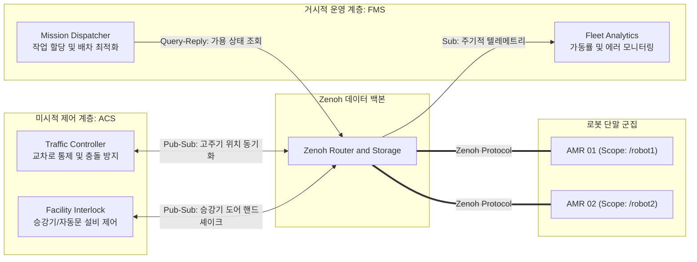
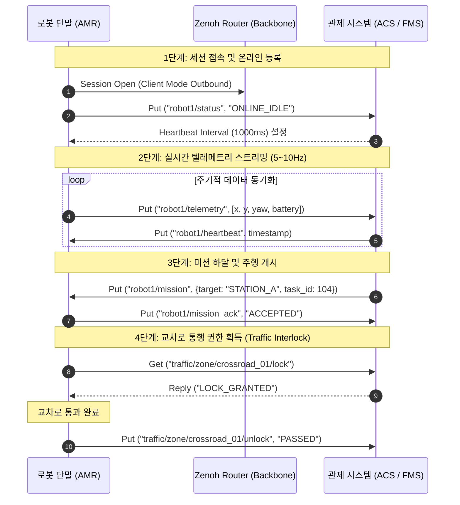
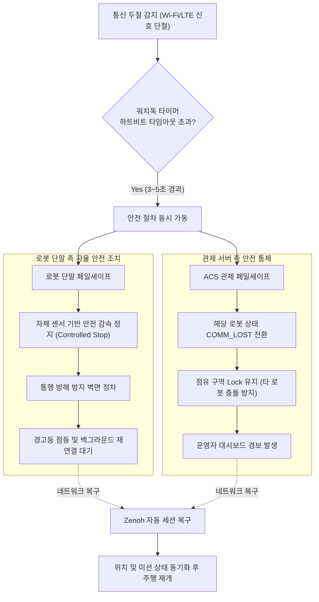
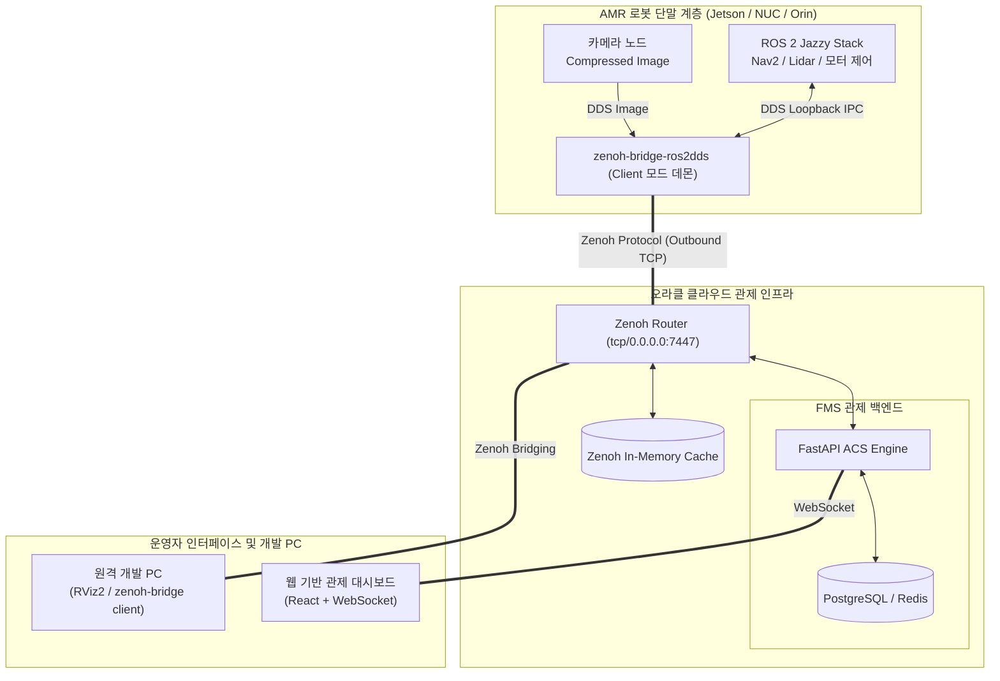

# Eclipse Zenoh 심층 기술 분석 및 차세대 AMR 관제 아키텍처 가이드

---

## 1. Zenoh 개요 및 등장 배경

**Eclipse Zenoh**(제노, /zɛnoʊ/)는 엣지(Edge), 클라우드(Cloud), 로봇 단말(Robotics) 및 마이크로컨트롤러(MCU)를 아우르는 **초경량·초저지연 데이터 통신 미들웨어(Data in Motion and at Rest)**입니다.

### 1) 기존 로보틱스 및 IoT 미들웨어의 구조적 한계
* **DDS (Data Distribution Service):**
  * 공장 LAN과 같은 폐쇄망 유선 환경의 멀티캐스트(Multicast) 기반으로 설계되었습니다.
  * 복잡한 건물 무선 Wi-Fi 음영 지역, 패킷 유실, WAN(인터넷/LTE) 횡단 시 노드 탐색을 위한 브로드캐스트 패킷이 폭증하는 **디스커버리 폭풍(Discovery Storm)**이 발생하며, 연결 단절 시 복구 지연이 큽니다.
* **MQTT:**
  * 중앙 브로커(Hub-and-Spoke) 집중형 구조로 인해 브로커 장애 시 시스템 전체가 마비되는 **단일 장애점(SPOF)**이 존재합니다.
  * 수십 MB/s 단위의 라이다 포인트클라우드나 다채널 고화질 비디오 스트림 전송 시 TCP 패킷 오버헤드와 브로커 메모리 병목 현상이 발생합니다.

### 2) Zenoh의 3대 핵심 설계 원칙
* **Zero Overhead:** 프로토콜 와이어 헤더 오버헤드를 불과 4~5바이트 수준으로 압축하여 저대역폭 무선망에서도 대역폭 낭비를 최소화합니다.
* **Unified Primitive:** Pub/Sub(이벤트 스트림), Query/Reply(분산 RPC), Storage(데이터 캐싱)를 단일 프로토콜로 통합하여 이기종 통신 스택 파편화를 해결합니다.
* **Rust 기반 고성능 엔진:** 극소 메모리/CPU 풋프린트를 유지하며 C, C++, Python, TypeScript(Web/Node.js) 바인딩을 공식 지원합니다.

---

## 2. Zenoh 아키텍처 및 네트워크 토폴로지

Zenoh는 물리적 네트워크 환경에 따라 세 가지 노드 유형을 유연하게 조합하여 계층형·메시형 토폴로지를 구성합니다.

> **핵심 개념 구분: Zenoh 노드 vs ROS 2 노드**
> * **ROS 2 노드:** 라이다 드라이버, 제어 알고리즘 등 소프트웨어 기능 단위의 **개별 프로세스**입니다.
> * **Zenoh 노드:** 물리 머신 또는 데몬 단위로 Zenoh 통신 네트워크에 참여하는 **네트워크 엔티티(역할)**입니다.
> * 로봇 내부의 수십 개 ROS 2 노드를 위해 브리지를 일일이 노드화할 필요가 없으며, **로봇 1대당 단 1개의 `zenoh-bridge-ros2dds` 프로세스(Zenoh Client 역할)**만 실행하면 로컬 DDS 전체 토픽이 중계됩니다.

### 1) 노드 구성 유형
* **Zenoh Router:** 네트워크 트래픽 중계, 토폴로지 라우팅 경로 관리, 분산 캐싱을 담당하는 백본 데몬 (클라우드 상시 상주).
* **Zenoh Peer:** 라우터 없이 로봇 간 1:1로 직접 세션을 맺고 통신할 수 있는 독립형 피어 노드.
* **Zenoh Client:** 라우터에 세션을 위임하여 송수신만 수행하는 초경량 노드. 로컬 수신 대기 포트(Listen Port)를 열지 않으므로 단말 기기 간 포트 충돌이 원천 방지됩니다.

### 2) 네트워크 토폴로지 구조도



---

## 3. 데이터 모델 및 3대 통신 프리미티브

Zenoh는 계층적 URI 경로 기반의 **키 표현식(Key Expression)**을 사용하며, 단일 채널 안에서 3가지 통신 패턴을 지원합니다.

* **키 표현식 예시:** `robot1/sensor/lidar`, `building/floor2/elevator/status`
* **와일드카드 탐색:** `*/status` 또는 `robot1/**` 형태로 여러 로봇의 특정 계층 데이터를 한 번에 구독할 수 있습니다.

### 1) 3대 프리미티브 기능 비교
| 프리미티브 | 통신 방식 | 주요 특징 | AMR 시스템 적용 사례 |
| :--- | :--- | :--- | :--- |
| **Pub / Sub** | Push (비동기 스트리밍) | 초저지연 단방향 이벤트 데이터 전송 | 로봇 위치(`pose`), 배터리 상태, 카메라 H.264 영상, 긴급 정지 토픽 |
| **Query / Reply** | Pull (분산 RPC 질의) | 특정 키 경로에 대해 1:N 노드로 동시 질의 후 응답 취합 | "현재 가용 상태인 로봇 조회", 로봇 주행 파라미터 요청 |
| **Storage (Queryable)**| Cache & Retrieve | 분산 저장소 플러그인에 최신 데이터 자동 저장 | "로봇 통신 두절 직전 최종 좌표 조회", 정적 맵 데이터 사전 적재 |

### 2) 통신 프리미티브 시퀀스 흐름도



---

## 4. 로봇 내부 및 외부 통신 아키텍처 배포 모델

로봇 내부(IPC/DDS)와 외부(관제) 간의 결합 방식은 시스템 안정성과 개발 복잡도에 따라 두 가지 모델로 구분됩니다.

### 1) 모델 A: 하이브리드 아키텍처 (현업 표준 권장)
* **내부 통신:** ROS 2 기본 DDS (CycloneDDS / FastDDS) 및 OS 루프백/공유 메모리 격리 (`ROS_LOCALHOST_ONLY=1`).
* **외부 통신:** 로봇 메인 컴퓨터당 **단 1개의 `zenoh-bridge-ros2dds` 프로세스** 구동.
* **동작 원리:** 
  * 로봇 내부 센서·제어기 간 통신은 마이크로초($\mu s$) 단위의 DDS 로컬 IPC로 완전 격리하여 처리합니다.
  * 단말 컴퓨터에 떠 있는 1개의 브릿지 프로세스가 내부 DDS 도메인의 모든 ROS 2 토픽을 자동 감지하여 Zenoh 패킷으로 변환, 클라우드 라우터로 중계합니다.
  * **네임스페이스 격리:** 브리지 실행 시 스코프(`-s /robot1`) 옵션을 통해 내부 ROS 2 토픽 코드를 일체 수정하지 않고 클라우드 상에서 로봇별 토픽을 분리합니다.
* **장점:** 기존 오픈소스 드라이버(Nav2, Lidar, Camera SDK)를 코드 수정 없이 100% 안정적으로 유지 가능합니다.

### 2) 모델 B: 순수 네이티브 통일 아키텍처 (`rmw_zenoh`)
* **내부 및 외부 통신:** DDS 계층을 전면 배제하고 `rmw_zenoh` 단일 스택 적용.
* **동작 원리:** ROS 2 노드가 DDS 패킷을 생성하지 않고 처음부터 Zenoh 세션으로 통신합니다.
* **장점:** DDS 고유의 Discovery 및 XML QoS 설정 파편화가 원천 제거됩니다.

### 3) 두 모델 구조 비교도



---

## 5. 관제 계층(FMS vs ACS)과의 통합 연동 체계

Zenoh는 상위 거시적 물류 운영 계층(FMS)과 하위 미시적 공간 제어 계층(ACS)을 단일 백본 위에서 서로 다른 프리미티브로 효율적으로 지원합니다.

### 1) FMS vs ACS 역할 정의
* **FMS (Fleet Management System - 거시적 운영 계층):** 작업 스케줄링, 최적 배차 알고리즘, 배터리 충전 계획, 가동률 KPI 분석을 담당합니다.
* **ACS (AMR Control System - 미시적 공간 제어 계층):** 교차로 충돌 방지, 교착(Deadlock) 해소, 일방통행 제어, 승강기 및 자동문 등 현장 물리 설비와의 연동을 담당합니다.

### 2) 통합 관제 데이터 흐름도



* **FMS 연동 (Query/Reply & Storage):** FMS는 작업 생성 시 Zenoh Query를 발행하여 현재 가용한 최적 로봇을 선별하고, 음영 지역 진입 시 캐싱된 마지막 상태를 조회합니다.
* **ACS 연동 (초저지연 Pub/Sub):** 수십 밀리초 주기의 위치 토픽(`*/odom`, `*/pose`)으로 교차로 충돌을 방지하고 설비와 핸드셰이크를 수행합니다.

---

## 6. ACS-로봇 통신 프로세스 및 네트워크 요구조건

### 1) End-to-End 통신 시퀀스



### 2) 물리적/논리적 네트워크 요구조건 (동일 네트워크 필요 여부)
* **결론: 로봇과 관제가 동일 로컬 서브넷(L2)에 있을 필요가 전혀 없습니다.**
* **WAN 횡단:** 클라우드 서버의 고정 공인 IP와 포트(기본 7447)만 개방되어 있으면 LTE, 5G, 상용 공유기(NAT) 등 서로 다른 통신망 환경에서도 완벽히 통신합니다.

---

## 7. 네트워크 단절(Fail-Safe) 및 로컬 격리 주행

### 1) 오프라인 상태에서의 로컬 ROS 2 자율주행
* **독립 주행 보장:** 로봇 내부 라이다, 카메라, SLAM, Nav2 제어 루프는 클라우드 연결 상태와 무관하게 로컬에서 정상 주행합니다.
* **필수 로컬 격리 환경변수:**
  ```bash
  export ROS_LOCALHOST_ONLY=1
  ```
  이 설정을 통해 외부 네트워크가 끊어지더라도 로컬 DDS 노드 바인딩이 유지되며, 현장 Wi-Fi에 멀티캐스트 폭풍을 유발하지 않습니다.

### 2) 네트워크 단절 시 단계별 페일세이프(Fail-Safe) 흐름도



---

## 8. 통신 프로토콜별 상세 비교 및 장단점 분석

### 1) 프로토콜별 기술 사양 종합 비교표

| 비교 항목 | Eclipse Zenoh | DDS (ROS 2 기본) | MQTT | WebRTC | WebSocket | HTTP / REST |
| :--- | :--- | :--- | :--- | :--- | :--- | :--- |
| **주요 목적** | 엣지-클라우드 통합 분산 미들웨어 | 고신뢰 실시간 분산 제어 | 경량 IoT 텔레메트리 | 실시간 브라우저 미디어 스트리밍 | 웹 전이중 양방향 통신 | 무상태 자원 CRUD 인터페이스 |
| **와이어 오버헤드**| **극소 (4~5 Bytes)** | 큼 (수십 Bytes 이상) | 작음 (2~5 Bytes + Header) | 중간 (RTP Header) | 작음 (2~10 Bytes Frame) | **매우 큼 (수백 Bytes)** |
| **네트워크 구조** | **P2P, Broker, Mesh 유연 지원** | P2P (멀티캐스트 기반) | Broker 중심 (Hub-Spoke) | P2P (시그널링 필요) | Client-Server | Client-Server |
| **전송 계층** | TCP, UDP, QUIC, Serial | UDP, Shared Memory | TCP (일부 TLS) | UDP 기반 (SRTP) | TCP | TCP |
| **대용량 미디어 전송**| **우수 (비디오/라이다 직접 전송)**| 유선 LAN만 가능 | 비효율적 (패킷 분할) | **최우수 (하드웨어 코덱 가속)**| 가능 (오버헤드 존재) | 부적합 |
| **무선망 내구성**| **최상 (자동 세션 복구)** | **매우 취약 (패킷 유실 시 마비)**| 양호 (TCP 기반 재연결) | 양호 (적응형 비트레이트) | 보통 (끊김 시 재연결 필요) | 보통 |

---

## 9. 실전 AMR & ACS/FMS 엔드투엔드 시스템 구조



---

## 10. 실전 브리지 구성 및 배포 실무 (`zenoh-bridge-ros2dds`)

### 1) Zenoh v1.x 최신 CLI 실행 방식 (권장)
* **단말 실행 필수 규칙:** 로컬 포트 충돌(`Address already in use`)을 방지하기 위해 명령어 끝에 **`client` 위치 인자**를 반드시 선언합니다.
* **다중 로봇 격리:** `-s /<robot_name>` 옵션으로 Zenoh 키 표현식에 로봇 네임스페이스를 접두어로 자동 부여합니다.

```bash
# 로봇 터미널 환경 격리 선언
export ROS_LOCALHOST_ONLY=1
export ROS_DOMAIN_ID=0

# 1번 로봇 브리지 실행
zenoh-bridge-ros2dds -s /robot1 -e tcp/217.142.247.51:7447 client

# 2번 로봇 브리지 실행
zenoh-bridge-ros2dds -s /robot2 -e tcp/217.142.247.51:7447 client

# 원격 메인 PC (모든 로봇 토픽을 수신하여 RViz 모니터링 시)
zenoh-bridge-ros2dds -e tcp/217.142.247.51:7447 client
```

### 2) 설정 파일 기반 방식 (`zenoh-bridge-ros2dds.json5`)
대역폭 절약을 위해 특정 토픽만 화이트리스트(Allowlist)로 필터링하여 전송할 때 사용합니다.

```json5
{
  // 1. 최신 v1.x 클라이언트 모드 명시 (로컬 포트 점유 방지)
  "mode": "client",

  // 2. 오라클 클라우드 라우터 접속 엔드포인트
  "connect": {
    "endpoints": ["tcp/217.142.247.51:7447"]
  },

  // 3. ROS 2 DDS 플러그인 상세 설정
  "plugins": {
    "ros2dds": {
      "scope": "/robot1",
      "domain": 0,
      
      // 전송 대역폭 절약을 위한 토픽 필터링
      "allow": {
        "publishers": [
          "/robot1/status",
          "/robot1/odom",
          "/robot1/battery_state"
        ],
        "subscribers": [
          "/robot1/cmd_vel",
          "/robot1/goal_pose"
        ]
      }
    }
  }
}
```
*실행 명령어:*
```bash
zenoh-bridge-ros2dds -c zenoh-bridge-ros2dds.json5
```

### 3) ROS 2 런치 파일 통합 자동 실행 (`robot_bringup.launch.py`)
별도의 터미널을 열지 않고 로봇 노드 실행 시 브리지를 함께 구동합니다.

```python
from launch import LaunchDescription
from launch.actions import ExecuteProcess
from launch_ros.actions import Node

def generate_launch_description():
    # Zenoh 브리지 백그라운드 프로세스 등록
    zenoh_bridge_cmd = ExecuteProcess(
        cmd=[
            'zenoh-bridge-ros2dds',
            '-s', '/robot1',
            '-e', 'tcp/217.142.247.51:7447',
            'client'
        ],
        name='zenoh_bridge',
        output='screen'
    )

    # 로봇 제어 노드 등록
    robot_node = Node(
        package='my_robot_driver',
        executable='robot_controller',
        name='robot_controller',
        output='screen'
    )

    return LaunchDescription([
        zenoh_bridge_cmd,
        robot_node
    ])
```

### 4) 실전 양산 배포: systemd 서비스 자동 등록
로봇 전원이 켜지면 터미널 조작 없이 브리지가 백그라운드 데몬으로 자동 구동되도록 설정합니다.

```ini
# /etc/systemd/system/zenoh-bridge.service
[Unit]
Description=Zenoh ROS 2 DDS Bridge Client
After=network-online.target
Wants=network-online.target

[Service]
Type=simple
User=ubuntu
Environment="ROS_LOCALHOST_ONLY=1"
Environment="ROS_DOMAIN_ID=0"
ExecStart=/usr/local/bin/zenoh-bridge-ros2dds -s /robot1 -e tcp/217.142.247.51:7447 client
Restart=always
RestartSec=3

[Install]
WantedBy=multi-user.target
```
*서비스 활성화 및 시작:*
```bash
sudo systemctl daemon-reload
sudo systemctl enable zenoh-bridge
sudo systemctl start zenoh-bridge
```

---

## 11. 종합 평가 및 도입 시 고려사항

**도입 효과 (Strengths)**
* **네트워크 파이프라인 단일화:** DDS(로컬), MQTT(관제), WebSocket(웹)으로 파편화되던 스택을 Zenoh 백본 하나로 단순화합니다.
* **무선 단절 극복:** 승강기 탑승 등 통신 음영 발생 후 복구 시 수십 ms 내에 세션을 자동 복구합니다.
* **제로카피 고성능:** Rust 엔진 기반의 4~5바이트 오버헤드로 저사양 단말에서도 고주기 텔레메트리를 지연 없이 중계합니다.

**도입 시 고려사항 (Risks & Mitigation)**
* **CLI 구동 버전 호환성:** Zenoh v1.x 최신 릴리즈 규격에 맞추어 `-m client` 플래그 대신 인자 맨 뒤에 `client`를 단독 선언해야 합니다.
* **단말 환경 격리 필수:** 다중 로봇 배포 시 로봇 컴퓨터마다 `ROS_LOCALHOST_ONLY=1`을 설정하고 브리지 스코프(`-s`)를 부여하여 로컬 Wi-Fi 간섭과 토픽 충돌을 차단해야 합니다.